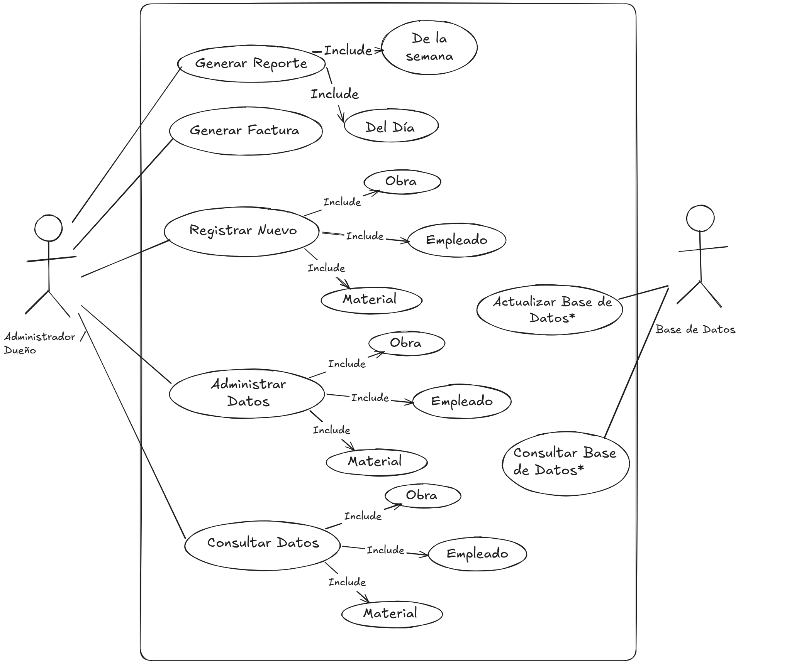

# Documento de SRS primera versión:

## 1. Introducción

1.1 Propósito

La creacion de este programa se debe a que la compañia busca una forma más eficiente de organizar sus obras y la información pertinente a cada una de ellas de una manera rápida y simple, para su consulta y creación de estos detalles.

1.2 Alcance

1.3 Personal Involucrado

1.4 Definiciones,acrónimos y abreviaturas

1.5 Referencias

1.6 Resumen

## 2. Descripción general

2.1 Perspectiva del producto

El sistema (SIS-1) Será un programa diseñado para la funcionalidad en el entorno del dispositivo de elección del Administrador o dueño, para facilitar y agilizar la administración de los recursos y proyectos de la empresa.

2.2 Funcionalidad del producto

2.3 Características de los usuarios
    
| Campo | Detalle |
| --------------- | ------------- |
| Tipo de usuario | Administrador |
| Formación | Conocimiento de la empresa |
| Actividades | Control y manejo del sistema en general |
    
2.4 Restricciones

- La interfaz debe tener acceso a la base de datos.
- Debe de accederse por medio del dispositivo de elección del dueño o administrador
- Lenguaje y tecnologias en uso: JAVA

2.5 Suposiciones y dependencias

- El dispositivo que ejecutará el sistema cumplirá con los requisitos para una ejecución sin complicaciones
- Se asume que el usuario del sistema será el único autorizado para el uso del sistema**
- Se asume que los requisitos descritos son estables.

## 3. Requisitos Especificos

 Requerimientos funcionales

| Campo | Detalle |
| :------------ | ------------- |
|Identificador del requerimiento|RF01|
|Nombre del Requerimiento||
|Caracteristicas||
|Descripción del Requerimiento||
|Requerimiento No Funcional||
|Prioridad del Requerimiento: |

| Campo | Detalle |
| :------------ | ------------- |
|Identificador del requerimiento|RF02|
|Nombre del Requerimiento||
|Caracteristicas||
|Descripción del Requerimiento||
|Requerimiento No Funcional||
|Prioridad del Requerimiento: |

| Campo | Detalle |
| :------------ | ------------- |
|Identificador del requerimiento|RF03|
|Nombre del Requerimiento||
|Caracteristicas||
|Descripción del Requerimiento||
|Requerimiento No Funcional||
|Prioridad del Requerimiento: |

| Campo | Detalle |
| :------------ | ------------- |
|Identificador del requerimiento|RF04|
|Nombre del Requerimiento||
|Caracteristicas||
|Descripción del Requerimiento||
|Requerimiento No Funcional||
|Prioridad del Requerimiento: |

| Campo | Detalle |
| :------------ | ------------- |
|Identificador del requerimiento|RF05|
|Nombre del Requerimiento||
|Caracteristicas||
|Descripción del Requerimiento||
|Requerimiento No Funcional||
|Prioridad del Requerimiento: |

...

Requerimientos No Funcionales
    
| Campo | Detalle |
| :------------ | ------------- |
|Identificador del requerimiento|RNF01|
|Nombre del Requerimiento||
|Caracteristicas||
|Descripción del Requerimiento||
|Prioridad del Requerimiento: |

| Campo | Detalle |
| :------------ | ------------- |
|Identificador del requerimiento|RNF02|
|Nombre del Requerimiento||
|Caracteristicas||
|Descripción del Requerimiento||
|Prioridad del Requerimiento: |

| Campo | Detalle |
| :------------ | ------------- |
|Identificador del requerimiento|RNF03|
|Nombre del Requerimiento||
|Caracteristicas||
|Descripción del Requerimiento||
|Prioridad del Requerimiento: |

| Campo | Detalle |
| :------------ | ------------- |
|Identificador del requerimiento|RNF04|
|Nombre del Requerimiento||
|Caracteristicas||
|Descripción del Requerimiento||
|Prioridad del Requerimiento: |

...